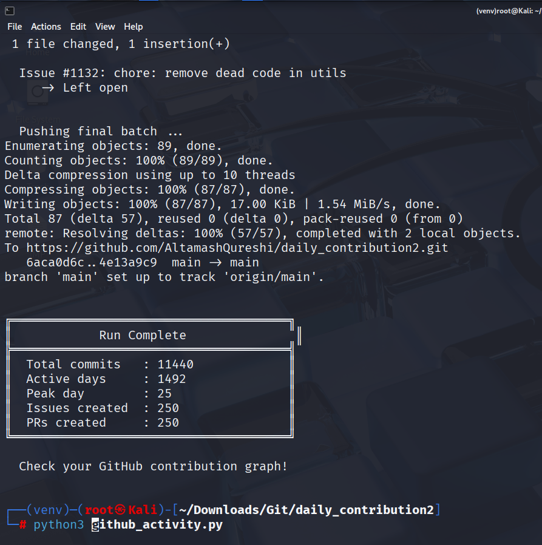

# 🟩 GitHub Activity Graph Enhancer

> Automatically populate your GitHub contribution graph with realistic commits, issues, and pull requests — spread across a custom date range.


---

## 📋 Table of Contents

- [Overview](#overview)
- [Features](#features)
- [Prerequisites](#prerequisites)
- [Installation](#installation)
- [Configuration](#configuration)
- [Usage](#usage)
- [How It Works](#how-it-works)
- [Sample Output](#sample-output)
- [Notes & Warnings](#notes--warnings)

---

## Overview

**GitHub Activity Graph Enhancer** is a Python script that backfills your GitHub contribution graph by programmatically creating commits, issues, and pull requests over a specified date range. It simulates natural human activity patterns — including burst weeks, weighted daily commit counts, and randomized commit messages — to produce a realistic-looking contribution history.

Two versions are included:

| File | Version | Start Date Default |
|---|---|---|
| `github_activity.py` | v1.0 | July 5, 2021 |
| `V2github_activity.py` | v2.0 | January 5, 2020 |

---

## Features

- 📅 **Custom date range** — set any `START_DATE` and `END_DATE`
- 🔀 **Weighted commit distribution** — 0–18 commits/day with realistic frequency weights
- 💥 **Burst streaks** — random high-activity periods to mimic real development sprints
- 🐛 **Issue creation** — auto-creates GitHub issues with varied titles and bodies
- 🔃 **Pull request simulation** — creates PRs on temp branches, merges or closes them
- ♻️ **Resume / checkpoint support** — safely continue interrupted runs via `.activity_checkpoint`
- 📦 **Batch pushing** — pushes in configurable batch sizes to avoid timeouts
- 🔁 **Retry logic** — handles API rate limits and transient failures with configurable retries

---

## Prerequisites

Before running the script, set up an isolated Python environment and install the required dependency.

### 1. Create & Activate a Virtual Environment

```bash
# Create virtual environment
python3 -m venv venv

# Activate venv on Linux/macOS
source venv/bin/activate

# On Windows use:
# venv\Scripts\activate
```

### 2. Upgrade pip & Install Dependencies

```bash
# Upgrade pip
pip install --upgrade pip

# Install requests
pip install requests
```

### 3. Create a `.gitignore`

```bash
# Create .gitignore to exclude venv and Python bytecode
cat > .gitignore <<EOF
venv/
*.py
*.pyc
__pycache__/
EOF
```

### 4. Verify Your Environment

```bash
# Verify active venv
which python
which pip
```

Both commands should point to paths inside your `venv/` folder.

### 5. Initialise the Git Repository

```bash
# Initialise git and make the first commit
git init
git add .
git commit -m "Initial commit with venv and requests setup"
```

### 6. GitHub Personal Access Token (PAT)

You need a GitHub PAT with **`repo` scope**:

1. Go to **GitHub → Settings → Developer Settings → Personal Access Tokens → Tokens (classic)**
2. Click **Generate new token**
3. Select the `repo` scope (full control of private repositories)
4. Copy the token — you'll paste it into the `CONFIG` section of the script

---

## Installation

```bash
# Clone the repository
git clone https://github.com/<your-username>/<your-repo>.git
cd <your-repo>

# Set up environment (see Prerequisites above)
python3 -m venv venv
source venv/bin/activate
pip install --upgrade pip
pip install requests
```

---

## Configuration

Open `github_activity.py` (or `V2github_activity.py`) and edit the `CONFIG` section near the top of the file:

```python
START_DATE        = datetime(2021, 7, 5)       # First day of backfill
END_DATE          = datetime.today()            # Last day (defaults to today)

GIT_EMAIL         = "your-email@example.com"   # Email linked to your GitHub account
GIT_NAME          = "your-github-username"     # Your GitHub display name
GITHUB_TOKEN      = "ghp_xxxxxxxxxxxx"         # Your PAT (repo scope required)
GITHUB_USERNAME   = "your-github-username"     # Your GitHub username
GITHUB_REPO       = "your-repo-name"           # Repository name (not the full URL)

BRANCH            = "main"                     # Target branch
```

### Optional Tuning

| Parameter | Default | Description |
|---|---|---|
| `BURST_WEEK_PROBABILITY` | `0.08` | Chance of a burst week starting on any given day |
| `BURST_BONUS_MIN/MAX` | `4` / `8` | Extra commits added during burst days |
| `AVG_ISSUES_PER_WEEK` | `4` | Average number of issues created per week |
| `AVG_PRS_PER_WEEK` | `3` | Average number of PRs created per week |
| `API_MAX_RETRIES` | `4` | Maximum retries on failed API calls |
| `PUSH_BATCH_SIZE` | `150` | Number of local commits before a push is triggered |

---

## Usage

Make sure you are inside a cloned GitHub repository directory and your virtual environment is active, then run:

```bash
# v1.0
python3 github_activity.py

# v2.0 (extended date range, additional improvements)
python3 V2github_activity.py
```

If the run is interrupted, simply re-run the same command — the script will resume from the last checkpoint automatically.

---

## How It Works

1. **Validates config** — exits early with a clear error if the token or repo name is missing.
2. **Sets up git identity** — applies `GIT_NAME` and `GIT_EMAIL` to the local repo config.
3. **Iterates day by day** — from `START_DATE` to `END_DATE`, choosing a commit count using the weighted distribution.
4. **Makes real file changes** — appends a unique line to `activity.log` for every commit, so each commit has a genuine diff (GitHub ignores `--allow-empty` commits on the graph).
5. **Backdates commits** — sets `GIT_AUTHOR_DATE` and `GIT_COMMITTER_DATE` environment variables to stamp each commit at its intended historical time.
6. **Creates issues & PRs** — uses the GitHub REST API to open issues and pull requests at a realistic weekly cadence.
7. **Pushes in batches** — after every `PUSH_BATCH_SIZE` commits to keep memory usage low and avoid push timeouts.
8. **Saves a checkpoint** — writes `.activity_checkpoint` after each day so the run can be resumed if interrupted.

---

## Sample Output

```
  Date range  : 2021-07-05 -> 2025-04-19
  Total days  : 1384
  Commit dist : 0-18/day  (weighted)
  Issues/week : ~4  |  PRs/week: ~3

  [████████████████████] 2025-04-19        8 commits

  Pushing final batch ...

╔══════════════════════════════════════╗
║            Run Complete               ║
╠══════════════════════════════════════╣
║  Total commits   : 11440             ║
║  Active days     : 1492              ║
║  Peak day        : 25                ║
║  Issues created  : 250               ║
║  PRs created     : 250               ║
╚══════════════════════════════════════╝

  Check your GitHub contribution graph!
```

---

## 📸 Proof of Execution

The screenshot below shows a real terminal run completing successfully on Kali Linux, with the final push to GitHub and the summary stats box:



Key details visible in the run:
- **11,440 total commits** pushed across **1,492 active days**
- **250 issues** and **250 PRs** created via the GitHub API
- Final batch pushed to `https://github.com/AltamashQureshi/daily_contribution2`
- Script run with an active virtual environment: `(venv) root@Kali`

---

## Notes & Warnings

- **Use responsibly.** This tool is intended for personal learning, portfolio development, and testing. Misrepresenting contribution history in professional contexts is discouraged.
- **Rate limits.** The GitHub API enforces rate limits. The script includes retry logic, but very large date ranges may take several hours to complete.
- **Token security.** Never commit your PAT to a public repository. The provided `.gitignore` excludes `*.py` files, but consider storing the token in an environment variable for extra safety.
- **Existing repos.** Run this inside a dedicated repository rather than an active project repo to avoid polluting your commit history.
- **Windows users.** Replace `source venv/bin/activate` with `venv\Scripts\activate` when activating the virtual environment.
